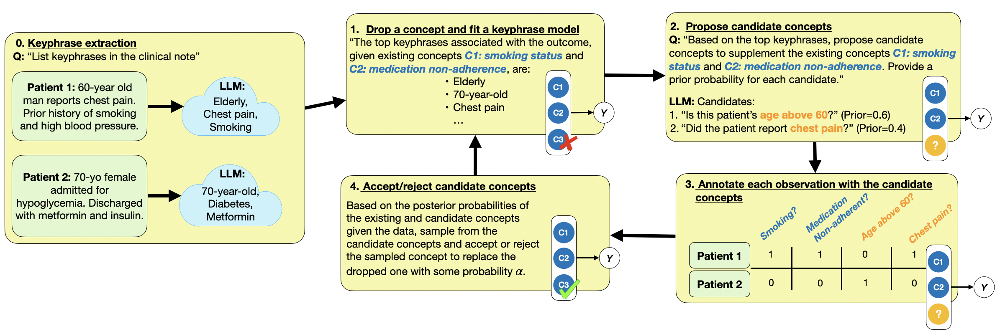

<h1 align="center"> 🔍 BC-LLM 🔍 </h1>
<p align="center"> <b>Bayesian Concept Bottleneck Models with LLM Priors</b>  (<a href="https://arxiv.org/abs/2410.15555">Feng et al. 2024</a>). 
</p>

<p align="center">
  
  
</p>  



> Concept Bottleneck Models (CBMs) have been proposed as a compromise between white-box and black-box models, aiming to achieve interpretability without sacrificing accuracy. The standard training procedure for CBMs is to predefine a candidate set of human-interpretable concepts, extract their values from the training data, and identify a sparse subset as inputs to a transparent prediction model. However, such approaches are often hampered by the tradeoff between enumerating a sufficiently large set of concepts to include those that are truly relevant versus controlling the cost of obtaining concept extractions. This work investigates a novel approach that sidesteps these challenges: BC-LLM iteratively searches over a potentially infinite set of concepts within a Bayesian framework, in which Large Language Models (LLMs) serve as both a concept extraction mechanism and prior. BC-LLM is broadly applicable and multi-modal. Despite imperfections in LLMs, we prove that BC-LLM can provide rigorous statistical inference and uncertainty quantification. In experiments, it outperforms comparator methods including black-box models, converges more rapidly towards relevant concepts and away from spuriously correlated ones, and is more robust to out-of-distribution samples.


## Reproducing experiments
All experiments are managed using `scons` and `nestly`.
If you want to run a single experiment, specify the experiment's folder name, e.g. `scons exp_mimic`.

**LLM Api**

To use the either the OpenAI models or Hugging Face models through the API add a .env file in the root folder of this directory

```bash
llm-vi $ touch .env
```

Add your token for Open AI and/or Hugging face
```bash
llm-vi $ echo "OPENAI_ACCESS_TOKEN=<YOUR TOKEN>" >> .env
llm-vi $ echo "HF_ACCESS_TOKEN=<YOUR TOKEN>" >> .env
```


### Citation
If you find our paper and code useful, please cite us:
```r
@misc{feng2024bcllm,
      title={Bayesian Concept Bottleneck Models with LLM Priors}, 
      author={Jean Feng and Avni Kothari and Luke Zier and Chandan Singh and Yan Shuo Tan},
      year={2024},
      eprint={2410.15555},
      archivePrefix={arXiv},
      primaryClass={cs.LG},
      url={https://arxiv.org/abs/2410.15555}, 
}
```